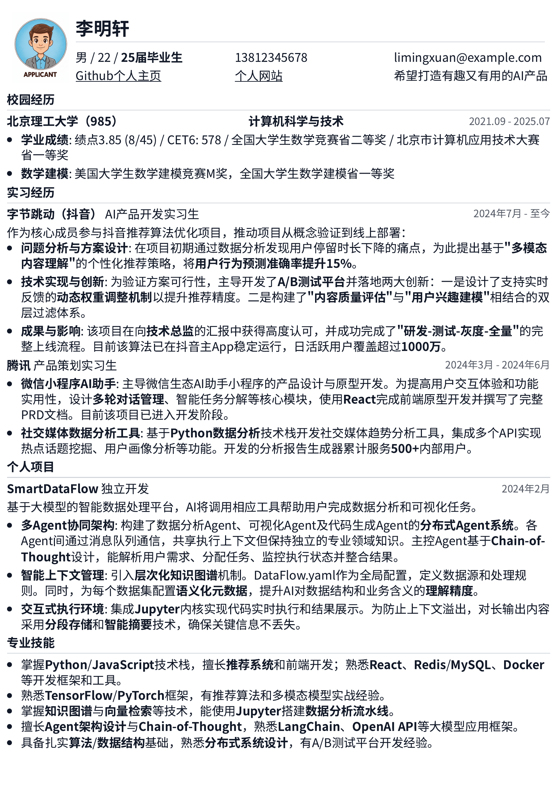
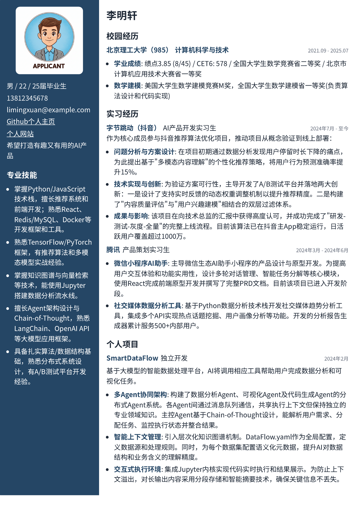
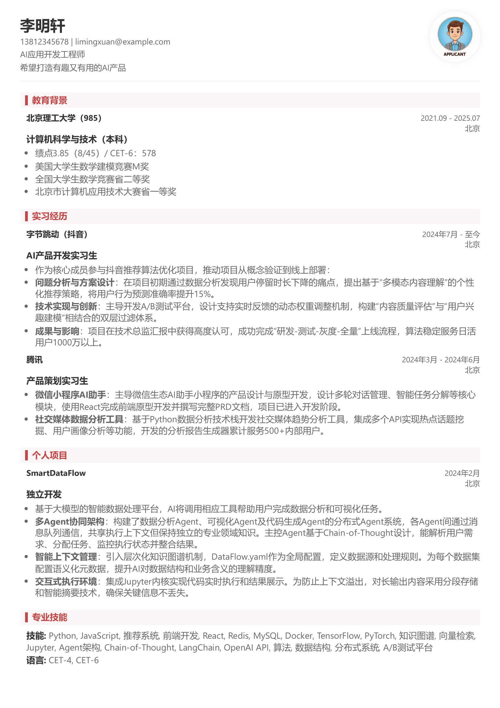
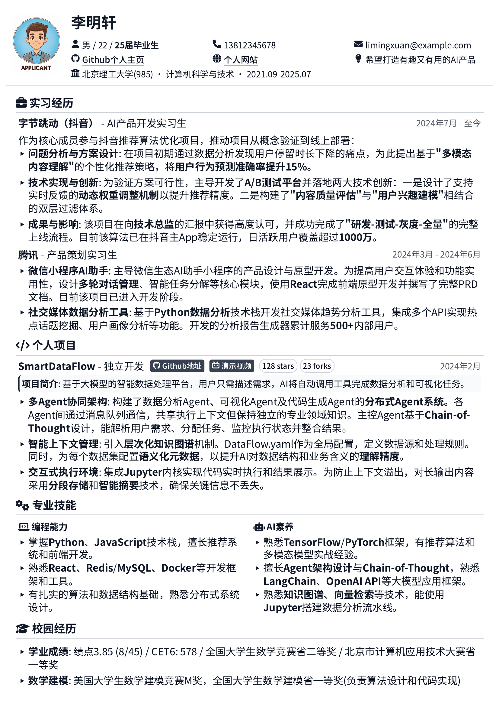
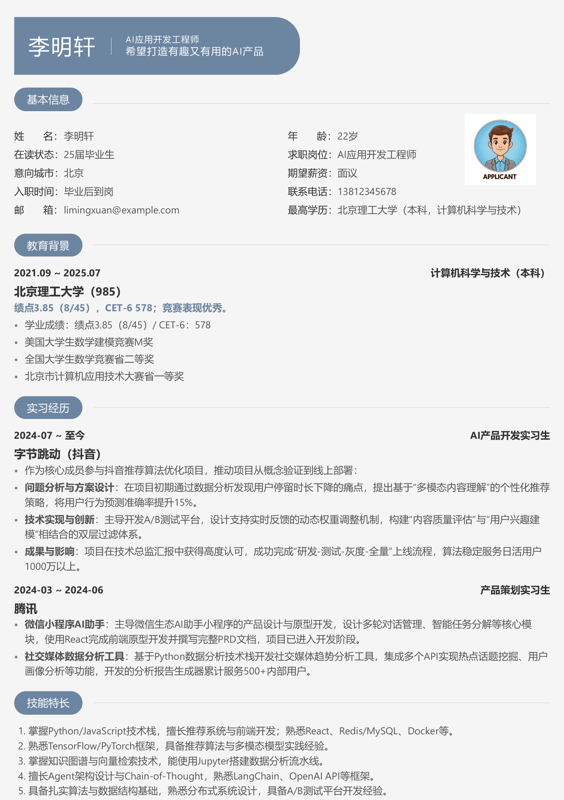

<div align="center">

# resume-skills

**把你的 Agent 变成简历导师，交付一份能打的 PDF。**

不是"生成一份简历"，而是有人陪你把经历挖出来、组织好、排到恰好一页。

[](https://github.com/wangyafu/resume-skills/stargazers)
[](skills/resume-master/SKILL.md)
[](#为什么是-html)

</div>

---

## 你大概遇到过这些

| 你说 | 常见的 AI 简历工具 | 这个 Skill |
|---|---|---|
| 「帮我改简历」 | 要你先把经历整理成文档 | 追着你问，每个问题都带选项 |
| 「这行太挤了」 | 重新生成一份完全不同的 | 改一个数值，3 秒重出 PDF |
| 「保持我原来的样子」 | 把你塞进它的模板里 | 拆图看懂你的排版，再动手 |
| 「我要一页」 | 说"好的"，然后给你两页 | 每改一次就数一次页数 |

---

## 五套模板

选完只是起点，之后每个细节都还能聊。

<div align="center">

| 极简纯白 | 沉稳双栏 | 典雅酒红 |
|:---:|:---:|:---:|
|  |  |  |

| 极客风尚 | 清新蓝灰 |
|:---:|:---:|
|  |  |

</div>

每套模板都提供两个版本：**HTML 给 AI 读**（学风格），**图片和 PDF 给你看**（做选择）。

---

## 三十秒装好

把这个链接甩给你的 Agent：

```
https://github.com/wangyafu/resume-skills
帮我安装这个简历 skill，并安装所需的 python 依赖
```

完事。然后跟它说「帮我写份简历」或者「读一下我这份旧简历」。

<details>
<summary>手动安装 / 环境要求</summary>

把 `skills/resume-master` 整个目录复制到全局 skills 目录：

| Agent | 目录 |
|---|---|
| Claude Code | `~/.claude/skills/` |
| Codex | `~/.codex/skills/` |
| Antigravity | `~/.gemini/antigravity/skills/` |

环境要求：

```bash
pip install pymupdf pypdf   # PDF 拆图与页数统计
```

PDF 拆图也可使用 Poppler 的 `pdftoppm` 或 ImageMagick 替代。导出 PDF 需要本机装有 **Google Chrome**（脚本会自动找）；找不到时会提示你手动用浏览器打印，不会卡住流程。

</details>

---

## 它凭什么不一样

### 📄 它**看得见**你的简历，不只是读得懂

大部分工具读你的旧 PDF，是提取文本。

但简历是**排版作品**。提文本丢掉的恰恰是最要命的东西——字号、间距、模块顺序，以及有没有整段内容被页面底部悄悄吃掉。源文件里明明写了四条，印出来只剩一条，提文本永远发现不了，拆成图片看一眼就知道。

所以 Skill 里写死了一条规矩：

> **读 PDF 必须先拆成图片，一页一页地看。不许偷懒提文本。**

这也意味着，改旧简历时它能**延续你原有的视觉风格**，而不是把你搬进一个新模板。

### 🔢 「恰好一页」不是一句口号

`pdf_page_count.py` 存在的意义就是让这条规范可执行：

- 超出一页 → 压间距、减字号、裁内容
- 留白太多 → 加字号、补细节、丰富经历

每改一次查一次。没有这个脚本，「简历最好一页」就只是句正确的废话。

### 💬 它会反过来问你

不是「你给材料 → 它套模板」。

- **每个问题都附选项**，让你做识别题，不做问答题
- **不等问完才动手**——凑够姓名和一段经历就先把 HTML 拍给你看，因为人看着实物想起来的东西，比干坐着回答问题多得多
- **不让你自己整理经历**，那是它的活
- 只有结果没有动作，它会问你具体做了什么；没有数字，它会追着你要数字

### 🎨 你负责说，它负责实现

「这行太挤」「这块往上挪」「字再小半号」「把这段改成两列」——

说人话，重新编译，三秒出 PDF。

---

## 为什么是 HTML

这是这个项目最核心的一个判断。

- **Markdown** 排不出该有的效果，比如分栏
- **LaTeX / Typst** 先天为排版而生，但 AI 写它们至今容易犯语法错误
- **HTML** 是 AI 最熟悉的标记语言，而且只需要一个浏览器就能打印成 PDF

让 AI 生成 Word，它是在**猜排版**；让 AI 写 HTML，它是在**设计**。

在 HTML 里，AI 既稳定又有审美。

---

## 三种用法

| 场景 | 它会做什么 |
|---|---|
| **从零开始** | 先问你想要哪套模板 → 访谈式挖经历 → 边聊边出 HTML → 确认后编译 PDF |
| **改旧简历** | 拆图读懂旧简历（内容 + 排版）→ 分析 JD → 决定就地编辑还是重写 → 编译 |
| **只做导出** | `python scripts/render_pdf.py --in <path> --out <name>.pdf --paper A4` |

---

## 里面装了什么

```
skills/resume-master/
├── SKILL.md                    # 简历写作规范 + 访谈原则 + 三条工作流
├── assets/template_refs/
│   ├── html/                   # 五套模板，给 AI 读
│   ├── images/                 # 五套模板，给你挑
│   └── pdf/                    # 五套模板，看实际打印效果
└── scripts/
    ├── render_pdf.py           # HTML → PDF，不带页眉页脚时间戳
    ├── pdf_to_images.py        # PDF → 图片，让 AI 看见排版
    └── pdf_page_count.py       # 数页数，死守一页
```

一段 prompt，五套模板，三个脚本。

---

## 后续计划

- [ ] 更多模板
- [ ] 分行业、分岗位的指导文件
- [ ] 更狠的经历深挖：让它主动发现「这段经历你写漏了什么」

---

## 一起把它做得更好

特别欢迎这三类分享：

- 你**真实在用**的简历模板
- 你写简历总结出的经验
- 你对「什么是好简历」的认知

提 Issue、发 PR，或者在小红书上找我：[Wonderful王](https://www.xiaohongshu.com/user/profile/635f85b8000000001901fe43)

---

<div align="center">

**如果它帮到了你，给个 ⭐️ 是对开源最大的鼓励。**

</div>
